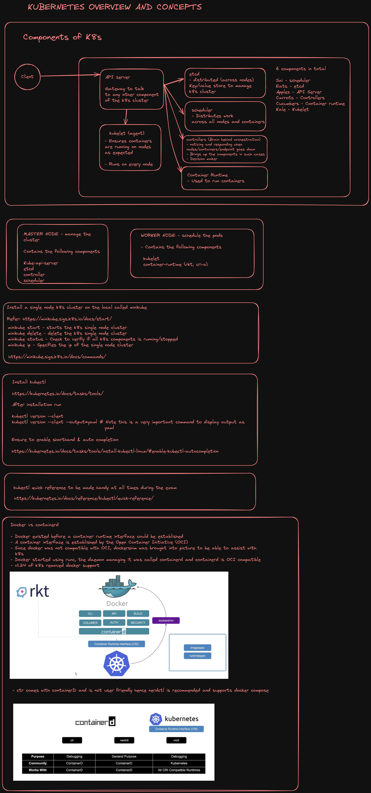

# Kubernetes Overview

## Container Orchestration
##### **Automatically deploying and managing container**

 *  Kubernetes  
 *  Docker swarm
 *  Mesos

## Kubernetes Architecture



## Pods
Create an NGINX Pod
```kubectl
kubectl run nginx --image=nginx
```

Create a deployment
```kubectl
kubectl create deployment nginx --image=nginx
```
